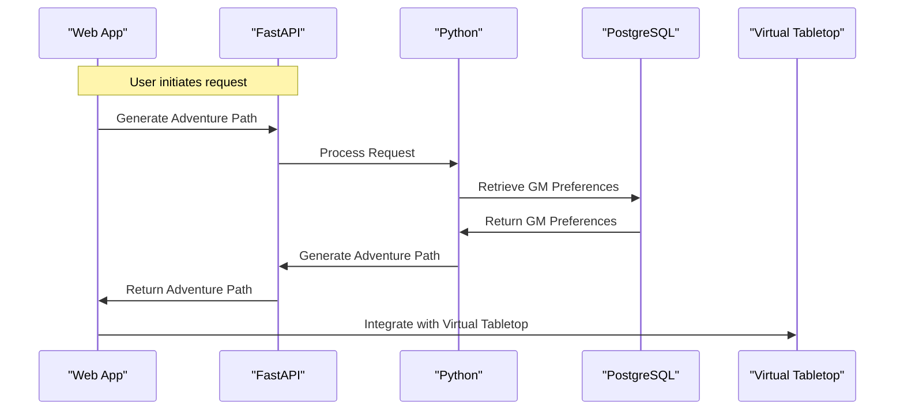
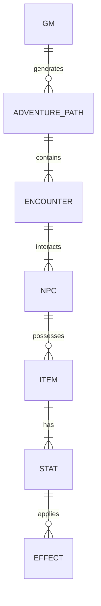

# AI-powered Adventure Path Generator
### MVP Architecture Document
> **Team:** talha – **Duration:** 12 weeks – **Stack:** Python, PyTorch, FastAPI, Hugging Face, PostgreSQL, Docker

---

## 1. Executive Summary
The AI-powered Adventure Path Generator is an innovative tool designed to streamline the workflow of experienced Game Masters (GMs) by leveraging natural language processing (NLP) and machine learning (ML) to create customized adventure paths. This project aims to address the pressing issue of GMs spending numerous hours preparing and writing adventure paths, which often lack flexibility and customization. By integrating with popular virtual tabletop platforms, the generator ensures seamless adoption and provides a tailored solution for the GM community. The end-user experience will be centered around a user-friendly interface where GMs can input their preferences, and the AI-powered system will generate a unique adventure path.

The core problem this project solves is the lack of flexibility and customization in current adventure path solutions. The AI-powered Adventure Path Generator delivers value by providing GMs with a tool that can generate customized adventure paths based on their input, saving them time and effort. The system will also allow GMs to integrate their generated adventure paths with virtual tabletop platforms, making it easy to share and play with their players.

## 2. System Architecture Overview

### 2.1 High-Level Architecture Diagram
```
                          +---------------+
                          |  Client      |
                          |  (Web App)   |
                          +---------------+
                                    |
                                    |
                                    v
                          +---------------+
                          |  API Layer   |
                          |  (FastAPI)    |
                          +---------------+
                                    |
                                    |
                                    v
                          +---------------+
                          |  Middleware  |
                          |  (PyTorch,     |
                          |   Hugging Face)|
                          +---------------+
                                    |
                                    |
                                    v
                          +---------------+
                          |  Service Layer|
                          |  (Python)      |
                          +---------------+
                                    |
                                    |
                                    v
                          +---------------+
                          |  Repository   |
                          |  Layer (SQL)   |
                          +---------------+
                                    |
                                    |
                                    v
                          +---------------+
                          |  Database     |
                          |  (PostgreSQL)  |
                          +---------------+
                                    |
                                    |
                                    v
                          +---------------+
                          |  External APIs|
                          |  (Virtual     |
                          |   Tabletop)    |
                          +---------------+
```

### 2.2 Request Flow Diagram (Mermaid)


### 2.3 Architecture Pattern
The architecture pattern chosen for this project is a layered architecture, consisting of a client layer, API layer, middleware layer, service layer, repository layer, and database layer. This pattern suits the team size and timeline as it allows for a clear separation of concerns, making it easier to develop and maintain the system.

### 2.4 Component Responsibilities
The client layer is responsible for handling user input and displaying the generated adventure path. It does not own the business logic or data storage. The API layer handles incoming requests and routes them to the appropriate service. The middleware layer is responsible for integrating with external APIs, such as virtual tabletop platforms. The service layer owns the business logic and interacts with the repository layer to retrieve and store data. The repository layer is responsible for data storage and retrieval, using the database layer as the underlying storage mechanism.

## 3. Tech Stack & Justification

| Layer | Technology | Why chosen |
|-------|-----------|------------|
| Client | Web App | Provides a user-friendly interface for GMs to input their preferences and receive generated adventure paths |
| API | FastAPI | Offers high-performance and ease of use for building RESTful APIs |
| Middleware | PyTorch, Hugging Face | Provides a robust and flexible framework for building and integrating AI models |
| Service | Python | Offers a versatile and widely-used language for building the business logic and interacting with the repository layer |
| Repository | SQL | Provides a structured and efficient way to store and retrieve data |
| Database | PostgreSQL | Offers a reliable and scalable database management system |
| External | Virtual Tabletop | Provides a platform for GMs to integrate and play their generated adventure paths |

## 4. Database Design

### 4.1 Entity-Relationship Diagram


### 4.2 Relationship & Association Details
The relationship between GM and ADVENTURE_PATH is one-to-many, as a GM can generate multiple adventure paths. The cardinality is enforced at the application level, and the join strategy is to retrieve the adventure path by GM ID. The cascade behavior on delete is set to cascade, so that when a GM is deleted, all associated adventure paths are also deleted.

The relationship between ADVENTURE_PATH and ENCOUNTER is one-to-many, as an adventure path can contain multiple encounters. The cardinality is enforced at the application level, and the join strategy is to retrieve the encounters by adventure path ID. The cascade behavior on delete is set to cascade, so that when an adventure path is deleted, all associated encounters are also deleted.

### 4.3 Schema Definitions (Code)
```python
from sqlalchemy import Column, Integer, String, ForeignKey
from sqlalchemy.orm import relationship

class GM(Base):
    __tablename__ = 'gm'
    id = Column(Integer, primary_key=True)
    name = Column(String)
    adventure_paths = relationship('AdventurePath', backref='gm')

class AdventurePath(Base):
    __tablename__ = 'adventure_path'
    id = Column(Integer, primary_key=True)
    gm_id = Column(Integer, ForeignKey('gm.id'))
    encounters = relationship('Encounter', backref='adventure_path')

class Encounter(Base):
    __tablename__ = 'encounter'
    id = Column(Integer, primary_key=True)
    adventure_path_id = Column(Integer, ForeignKey('adventure_path.id'))
    npc = relationship('NPC', backref='encounter')
```

### 4.4 Indexing Strategy
The indexing strategy for the database includes creating single indexes on the GM ID and adventure path ID columns, as well as a compound index on the encounter ID and NPC ID columns. This optimizes queries that retrieve adventure paths by GM ID and encounters by adventure path ID.

### 4.5 Data Flow Between Entities
When a GM initiates a request to generate an adventure path, the system creates a new adventure path entity and associates it with the GM. The system then generates a series of encounters and associates them with the adventure path. Each encounter is associated with a set of NPCs, which are associated with items and stats. The system then stores the generated adventure path and its associated encounters, NPCs, items, and stats in the database.

## 5. API Design

### 5.1 Authentication & Authorization
The API uses JSON Web Tokens (JWT) for authentication and authorization. When a GM logs in, the system generates a JWT token that is stored on the client-side. The token is then sent with each request to the API, where it is validated and used to authorize access to protected routes.

### 5.2 REST Endpoints
| Method | Path | Auth | Request Body | Response | Description |
|--------|------|------|--------------|----------|-------------|
| POST | /api/gm | Yes | GM details | GM ID | Create a new GM |
| GET | /api/gm/:id | Yes | - | GM details | Retrieve a GM by ID |
| POST | /api/adventure-path | Yes | Adventure path details | Adventure path ID | Create a new adventure path |
| GET | /api/adventure-path/:id | Yes | - | Adventure path details | Retrieve an adventure path by ID |

### 5.3 Error Handling
The API uses a standard error response format, with error codes and descriptive error messages. The system also logs errors and exceptions, and provides a mechanism for reporting and tracking errors.

## 6. Frontend Architecture

### 6.1 Folder Structure
```
src/
components/
GMForm.js
AdventurePathForm.js
EncounterForm.js
...
containers/
GMContainer.js
AdventurePathContainer.js
EncounterContainer.js
...
actions/
gmActions.js
adventurePathActions.js
encounterActions.js
...
reducers/
gmReducer.js
adventurePathReducer.js
encounterReducer.js
...
index.js
```

### 6.2 State Management
The frontend uses Redux for state management, with a single store that holds the entire application state. The state is divided into several slices, each managed by a separate reducer.

### 6.3 Key Pages & Components
The key pages and components include the GM form, adventure path form, and encounter form. Each form is a separate component that handles user input and submits the data to the API.

## 7. Core Feature Implementation

### 7.1 AI-powered Adventure Path Generation
The AI-powered adventure path generation feature uses a natural language processing (NLP) model to generate adventure paths based on GM input. The feature includes the following components:
* User flow: The GM initiates a request to generate an adventure path, providing input such as the adventure path's theme, tone, and difficulty level.
* Frontend: The GM form component handles user input and submits the data to the API.
* API call: The API receives the GM input and calls the NLP model to generate an adventure path.
* Backend logic: The NLP model generates an adventure path based on the GM input, using a combination of machine learning algorithms and natural language processing techniques.
* Database: The generated adventure path is stored in the database, associated with the GM.
* AI integration: The NLP model is integrated with the API, using a RESTful interface to receive input and return generated adventure paths.

### 7.2 Virtual Tabletop Integration
The virtual tabletop integration feature allows GMs to integrate their generated adventure paths with virtual tabletop platforms. The feature includes the following components:
* User flow: The GM initiates a request to integrate their adventure path with a virtual tabletop platform, providing input such as the platform's API credentials.
* Frontend: The adventure path form component handles user input and submits the data to the API.
* API call: The API receives the GM input and calls the virtual tabletop platform's API to integrate the adventure path.
* Backend logic: The API handles the integration with the virtual tabletop platform, using a combination of API calls and data processing.
* Database: The integrated adventure path is stored in the database, associated with the GM.
* AI integration: The virtual tabletop integration feature does not use AI integration.

## 7a. AI Pipeline Architecture
The AI pipeline architecture for the AI-powered adventure path generation feature includes the following components:
* Model choice: The system uses a pre-trained NLP model, fine-tuned for adventure path generation.
* Input construction: The system constructs input for the NLP model, using a combination of GM input and pre-defined templates.
* Prompt template: The system uses a pre-defined prompt template, which includes variable placeholders for GM input.
* API call implementation: The system calls the NLP model using a RESTful interface, passing the constructed input and prompt template.
* Response parsing: The system parses the response from the NLP model, using a combination of natural language processing techniques and machine learning algorithms.
* Storage: The system stores the generated adventure path in the database, associated with the GM.
* Frontend display: The system displays the generated adventure path to the GM, using a combination of text and multimedia elements.

## 8. Security Considerations
The system includes several security considerations, including:
* Input validation: The system validates all user input, using a combination of client-side and server-side validation.
* Authentication token storage: The system stores authentication tokens securely, using a combination of encryption and secure storage mechanisms.
* CORS policy: The system implements a CORS policy, which restricts access to the API based on origin and headers.
* Rate limiting: The system implements rate limiting, which restricts the number of requests that can be made to the API within a given time period.
* File upload safety: The system implements file upload safety mechanisms, which restrict the types of files that can be uploaded and validate their contents.
* Environment secrets management: The system implements environment secrets management, which securely stores sensitive environment variables and credentials.

## 9. MVP Scope Definition

### 9.1 In Scope (MVP)
The following features are included in the MVP scope:
* AI-powered adventure path generation
* Virtual tabletop integration
* GM-specific customization options
* Flexible and adaptable storyline generation

### 9.2 Out of Scope (Post-MVP)
The following features are excluded from the MVP scope:
* Multi-player support
* Real-time collaboration
* Advanced analytics and reporting

### 9.3 Success Criteria
The MVP is considered successful if the following criteria are met:
* The system generates adventure paths that meet the GM's input and preferences.
* The system integrates with virtual tabletop platforms seamlessly.
* The system provides a user-friendly interface for GMs to input their preferences and receive generated adventure paths.
* The system generates adventure paths that are engaging and fun for players.

## 10. Week-by-Week Implementation Plan

### Week 1-2: Project setup and planning
* Focus: Set up the project structure, configure the development environment, and plan the implementation.
* Deliverable: A fully set up project structure, a configured development environment, and a detailed implementation plan.
* Done-when: The project structure is set up, the development environment is configured, and the implementation plan is complete.

### Week 3-4: Frontend development
* Focus: Develop the frontend components, including the GM form, adventure path form, and encounter form.
* Deliverable: A fully functional frontend, with all components implemented and integrated.
* Done-when: The frontend is fully functional, and all components are implemented and integrated.

### Week 5-6: Backend development
* Focus: Develop the backend API, including the NLP model integration and virtual tabletop integration.
* Deliverable: A fully functional backend API, with all endpoints implemented and integrated.
* Done-when: The backend API is fully functional, and all endpoints are implemented and integrated.

### Week 7-8: Database development
* Focus: Develop the database schema, including the GM, adventure path, and encounter tables.
* Deliverable: A fully functional database schema, with all tables implemented and integrated.
* Done-when: The database schema is fully functional, and all tables are implemented and integrated.

### Week 9-12: Testing and deployment
* Focus: Test the entire system, including the frontend, backend, and database.
* Deliverable: A fully tested and deployed system, with all features implemented and integrated.
* Done-when: The system is fully tested and deployed, and all features are implemented and integrated.

## 11. Testing Strategy

| Type | Tool | What is tested | Target coverage |
|------|------|---------------|-----------------|
| Unit | Jest | Frontend components | 80% |
| Integration | Pytest | Backend API endpoints | 80% |
| End-to-end | Cypress | Entire system | 80% |

## 12. Deployment & DevOps

### 12.1 Local Development Setup
To set up the project locally, follow these steps:
1. Clone the repository using `git clone`.
2. Install the dependencies using `npm install`.
3. Configure the environment variables using `env`.
4. Start the development server using `npm start`.

### 12.2 Environment Variables
The following environment variables are required:
* `DB_HOST`: The database host.
* `DB_PORT`: The database port.
* `DB_USERNAME`: The database username.
* `DB_PASSWORD`: The database password.
* `VTT_API_KEY`: The virtual tabletop API key.

### 12.3 Production Deployment
The system will be deployed to a cloud platform, such as AWS or Google Cloud. The deployment will include:
* A load balancer to distribute traffic.
* A web server to serve the frontend.
* A backend server to handle API requests.
* A database server to store data.

## 13. Risk Register

| Risk | Likelihood | Impact | Mitigation |
|------|-----------|--------|-----------|
| NLP model accuracy | High | High | Implement a robust testing and validation process to ensure the NLP model is accurate and effective. |
| Virtual tabletop integration issues | Medium | Medium | Implement a flexible and adaptable integration mechanism to accommodate different virtual tabletop platforms. |
| Database scalability issues | Low | High | Implement a scalable database design and configure the database server to handle increased traffic. |
| Security vulnerabilities | High | High | Implement a robust security framework, including input validation, authentication token storage, and rate limiting. |
| Deployment issues | Medium | Medium | Implement a robust deployment process, including automated testing and continuous integration. |

By following this architecture document, the AI-powered Adventure Path Generator will provide a robust and scalable solution for GMs to generate customized adventure paths, integrating with virtual tabletop platforms and providing a user-friendly interface for GMs to input their preferences and receive generated adventure paths.